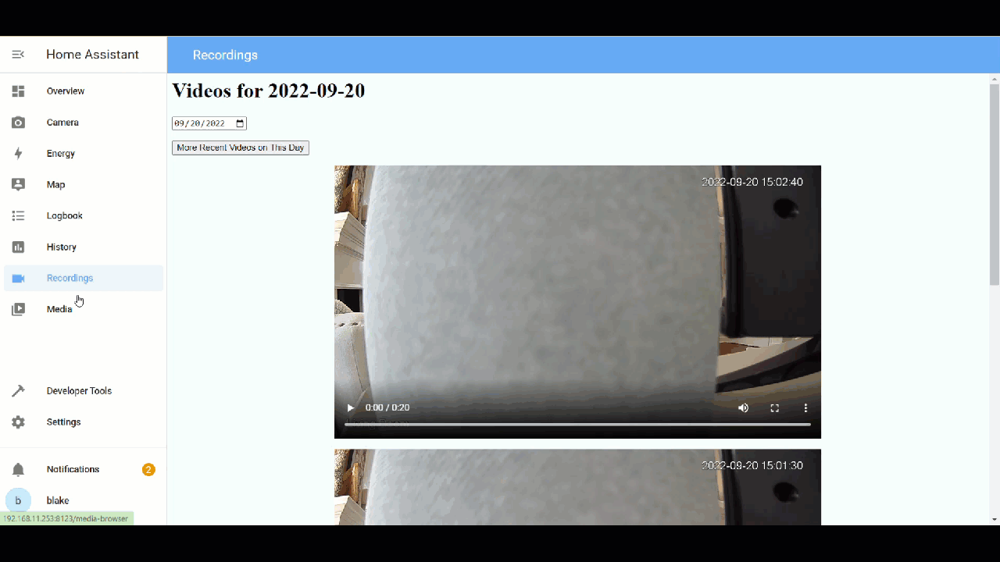

# View Amcrest-Recorded Videos on Home Assistant
View video recordings from Amcrest or other local cameras on Home Assistant via an iFrame'd Flask app.



## Setup
1. Configure an Amcrest camera (or other motion sensored camera) to write mp4 files to disk. For details on how to set up FTP with Amcrest, see [How to set up Amcrest with an FTP Server](#how-to-set-up-amcrest-with-an-ftp-server).
2. Clone the GitHub Project: ```git clone https://github.com/blakejarvis/homeassistant-video-viewer.git```
3. Set environment variables within the .env file:
   - `VIDEO_PATH` - The root of where Amcrest stores videos and writes dates. Within this directory should be date subdirectories auto-created by amcrest:
```2022-09-14  2022-09-15  2022-09-16  2022-09-17  2022-09-18  2022-09-19  2022-09-20  DVRWorkDirectory```
   - `PORT` - The desired port the web server should listen on.
4. Run `docker-compose up`
5. Add the following configuration within Home Assistant's `configuration.yaml`:
```
panel_iframe:
   recordings:
     title: "Recordings"
     url: "http://[ip-address-of-docker-host]:8090"
     icon: mdi:video
```

## How it Works
The Flask app uses a Docker volume mount to mount the root directory where Amcrest writes the files to disk. By default, Amcrest cameras store videos in the form of [yyyy-mm-dd]/hour[number]/dav/[video.mp4] and `app.py` walks these directories, and copies the mp4 files to the Docker container, grouping by date. When a user requests the Flask app, the app defaults to requesting today's date, and the first 3 videos. 

A user can use the datepicker to view videos on previous days, and can "scroll" through videos by selecting "more recent videos on this day" to view newer videos on the selected date, or view older videos on the selected date with the "older videos on this day" button. Only showing 3 video files and implementing "scrolling" is to increase performance, and avoid loading all mp4 files on a single day at once.

## How to set up Amcrest with an FTP Server
to do

## To Do
- Do FTP how-to section
- Add an option/switch for storing videos in an S3 bucket and using presigned URLs
- Optimize `app.py` by checking if an mp4 exists in the destination location before copying the file
